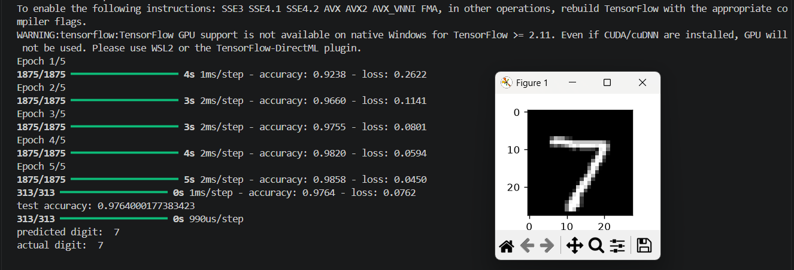

# 🧠 First Neural Network

> My first deep learning project built using TensorFlow and Keras to classify handwritten digits from the MNIST dataset.


---

## 🚀 Project Overview

This project implements a fully connected neural network capable of recognizing handwritten digits (0–9) from the famous MNIST dataset.

The model was built from scratch as part of my journey into Machine Learning and Deep Learning to understand the complete training pipeline, including:

* Data preprocessing
* Neural network architecture design
* Activation functions
* Backpropagation
* Model training
* Performance evaluation
* Prediction on unseen data

---

## 📊 Dataset

The project uses the **MNIST handwritten digit dataset** provided by TensorFlow.

| Feature           | Value           |
| ----------------- | --------------- |
| Training Images   | 60,000          |
| Test Images       | 10,000          |
| Image Size        | 28 × 28 pixels  |
| Number of Classes | 10 (digits 0–9) |

---

## 🏗️ Model Architecture

```text
Input Image (28 × 28)

        ↓

Flatten Layer

        ↓

Dense Layer (128 Neurons, ReLU)

        ↓

Output Layer (10 Neurons, Softmax)
```

---

## ⚙️ Technologies Used

* Python
* TensorFlow / Keras
* NumPy
* Matplotlib

---

## 🧪 Training Configuration

```python
model.compile(
    optimizer='adam',
    loss='sparse_categorical_crossentropy',
    metrics=['accuracy']
)

model.fit(x_train, y_train, epochs=5)
```

---

## 📈 Results

| Metric        | Value                           |
| ------------- | ------------------------------- |
| Test Accuracy | **97.58%**                      |
| Optimizer     | Adam                            |
| Loss Function | Sparse Categorical Crossentropy |
| Epochs        | 5                               |

---

## 🔍 Example Prediction

The trained model predicts the digit present in unseen handwritten images and outputs the corresponding class with the highest probability.

Example:

```text
Predicted Digit : 7
Actual Digit    : 7
```

---


## 📈 Training Output



---

## 🛠️ Installation

Clone the repository:

```bash
git clone https://github.com/vasantdesai212-dotcom/first-neural-network.git
```

Move into the project directory:

```bash
cd first-neural-network
```

Install dependencies:

```bash
pip install -r requirements.txt
```

Run the project:

```bash
python main.py
```

---

## 📌 Future Improvements

* Implement Convolutional Neural Networks (CNNs)
* Predict custom handwritten digits from uploaded images
* Create a web application using Streamlit
* Compare Dense Networks vs CNNs

---

## 📚 Key Concepts Learned

* Feedforward Neural Networks
* Dense Layers
* ReLU Activation Function
* Softmax Activation Function
* Backpropagation
* Gradient Descent
* Loss Functions
* Model Evaluation

---

## 📜 License

This project is licensed under the MIT License.
